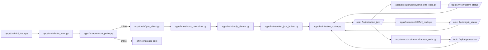

# 하이리온 Brain 아키텍처 및 토픽 연결 맵

기준: 2026-04-08
목적: 텍스트 입력부터 JSON 생성, 실행 노드 트리거까지를 파일 단위로 명확히 정리

---

## 1. 설계 원칙 요약

- Brain은 결정만 수행: 입력 해석, JSON 생성, 답장 문구 생성
- Executor는 실행만 수행: SMOLVLA/BHL/카메라는 JSON 조건이 맞을 때만 동작
- 통신 계층 분리: 비즈니스 로직(Brain/Executor)과 전송 방식(ROS2/local bus) 분리
- 오프라인 안전 동작: 인터넷 미연결 시 JSON 실행명령 생성 대신 안내 메시지 우선

---

## 2. 권장 폴더 구조

```text
hylion_ws/
├── apps/
│   ├── brain/
│   │   ├── brain_main.py
│   │   ├── cli_input.py
│   │   ├── network_probe.py
│   │   ├── groq_client.py
│   │   ├── intent_normalizer.py
│   │   ├── reply_planner.py
│   │   ├── action_json_builder.py
│   │   └── action_router.py
│   │
│   └── executors/
│       ├── smolvla/
│       │   ├── smolvla_node.py
│       │   └── smolvla_trigger.py
│       ├── bhl/
│       │   ├── bhl_node.py
│       │   └── bhl_trigger.py
│       └── camera/
│           ├── camera_node.py
│           └── camera_trigger.py
│
├── shared/
│   ├── schemas/
│   │   ├── action.schema.json
│   │   └── reply.schema.json
│   ├── contracts/
│   │   └── topic_contract.md
│   ├── config/
│   │   ├── settings.yaml
│   │   └── topics.yaml
│   └── utils/
│       ├── logging.py
│       ├── id_factory.py
│       └── time_utils.py
│
├── transport/
│   ├── ros2/
│   │   ├── ros2_publisher.py
│   │   └── ros2_subscriber.py
│   └── local/
│       └── local_queue_bus.py
│
├── scripts/
│   ├── run_brain.sh
│   ├── run_executors.sh
│   └── run_all_local.sh
│
├── tests/
│   ├── unit/
│   │   ├── test_network_probe.py
│   │   ├── test_intent_normalizer.py
│   │   └── test_action_json_builder.py
│   └── integration/
│       └── test_brain_to_executor_flow.py
│
└── docs/
    ├── architecture.md
    └── message_flow.md
```

---

## 3. 파일별 역할과 분류 이유

| 파일 | 역할 | 실행 시점 | 분류 이유 |
|---|---|---|---|
| apps/brain/brain_main.py | Brain 진입점, 입력 루프 실행 | 항상 | 오케스트레이션 중심 파일이므로 brain |
| apps/brain/cli_input.py | 터미널 텍스트 입력 수신 | 항상 | 사용자 입력 채널이 brain 책임 |
| apps/brain/network_probe.py | 인터넷 연결 확인 | 매 요청 전 | Groq 호출 전 조건 판단 로직 |
| apps/brain/groq_client.py | Groq 요청/응답 처리 | 온라인 시 | LLM 어댑터 책임 |
| apps/brain/intent_normalizer.py | LLM 응답을 intent 표준으로 정규화 | 온라인 시 | JSON 계약 준수 위해 정규화 필요 |
| apps/brain/reply_planner.py | 사용자 답장 텍스트 생성 | 모든 요청 | 대화 상호작용 품질 책임 |
| apps/brain/action_json_builder.py | 최종 Action JSON 생성 | 모든 요청 | Brain의 핵심 산출물 생성 |
| apps/brain/action_router.py | JSON을 토픽으로 발행 | 온라인/오프라인 | 통신 계층 연결 경계 |
| apps/executors/smolvla/smolvla_node.py | pick_place 실행 노드 | 조건 충족 시 | 실행 책임 분리 |
| apps/executors/smolvla/smolvla_trigger.py | pick_place 조건 판별 | JSON 수신 시 | 실행 조건 정책 분리 |
| apps/executors/bhl/bhl_node.py | gait 명령 실행 노드 | 조건 충족 시 | 하체 실행 분리 |
| apps/executors/bhl/bhl_trigger.py | 보행 조건 판별 | JSON 수신 시 | 실행 조건 정책 분리 |
| apps/executors/camera/camera_node.py | 카메라 캡처/제공 노드 | 필요 시 | 센서 자원 관리 분리 |
| apps/executors/camera/camera_trigger.py | 카메라 활성 조건 판별 | JSON 수신 시 | 불필요한 상시 실행 방지 |
| shared/schemas/action.schema.json | Action JSON 검증 스키마 | 빌드/런타임 | 노드 간 메시지 계약 표준 |
| shared/schemas/reply.schema.json | reply 블록 검증 | 빌드/런타임 | 대화 응답 형식 보장 |
| shared/contracts/topic_contract.md | 토픽 방향/타입 명세 | 개발 전/중 | 팀 간 인터페이스 충돌 방지 |
| shared/config/topics.yaml | 토픽명 중앙 관리 | 부팅 시 | 하드코딩 제거 |
| transport/ros2/*.py | ROS2 pub/sub 실제 구현 | ROS2 모드 | 통신 기술 분리 |
| transport/local/local_queue_bus.py | 로컬 개발용 이벤트 버스 | 로컬 모드 | 빠른 단일 PC 테스트 |

---

## 4. 실행 흐름 (온라인/오프라인)

### 4.1 온라인

1. cli_input.py가 사용자 텍스트 수신
2. network_probe.py가 인터넷 연결 확인
3. groq_client.py가 텍스트 분석 요청
4. intent_normalizer.py가 의도/객체 정규화
5. reply_planner.py가 답장 생성
6. action_json_builder.py가 최종 JSON 생성
7. action_router.py가 액션 토픽 발행
8. 각 executor 노드가 JSON을 수신하여 조건부 실행

### 4.2 오프라인

1. cli_input.py가 사용자 텍스트 수신
2. network_probe.py에서 offline 판정
3. Brain이 터미널에 인터넷 미연결 메시지 출력
4. 필요 시 fallback JSON만 생성하고 실행 명령은 비활성

---

## 5. 파일-토픽 연결 시각화

### 5.1 전체 연결 다이어그램 (파일 기준)



### 5.2 발행/구독 표 (한눈에 보기)

| 파일 | 발행 토픽 | 구독 토픽 | 비고 |
|---|---|---|---|
| apps/brain/action_router.py | /hylion/action_json | /hylion/perception, /hylion/soarm_status, /hylion/gait_status | Brain 중심 라우터 |
| apps/executors/smolvla/smolvla_node.py | /hylion/soarm_status | /hylion/action_json | pick_place일 때만 동작 |
| apps/executors/bhl/bhl_node.py | /hylion/gait_status | /hylion/action_json | gait_cmd 존재 시 동작 |
| apps/executors/camera/camera_node.py | /hylion/perception | /hylion/action_json | 팔 노드 실행과 함께 활성 |

---

## 6. JSON 스키마 제안 (답장 포함)

핵심 목표: 텍스트 입력과 사용자 답장, 실행 트리거를 하나의 계약으로 통일

필수 규칙:
- `reply_text`는 항상 포함 (온라인/오프라인 공통)
- `reply_text`는 빈 문자열 금지 (TTS도 동일 텍스트 사용)
- 오프라인일 때도 사용자 안내 답장을 `reply_text`에 반드시 채움

```json
{
  "action_id": "string",
  "timestamp": "ISO8601",
  "session_id": "string",
  "source": "terminal|mic",
  "network_online": true,
  "intent": {
    "type": "chat|pick_place|walk|stop|unknown",
    "target_object": "string"
  },
  "reply_text": "string",
  "execution": {
    "requires_smolvla": false,
    "requires_bhl": false
  },
  "gait_cmd": "walk_forward|turn_left|stop|none",
  "state_current": "IDLE|TALKING|MANIPULATING|WALKING|EMERGENCY",
  "safety": {
    "emergency_stop": false,
    "allowed": true
  },
  "fallback_policy": "string"
}
```

### 6.1 필수 항목(Required)

- `action_id`
- `timestamp`
- `network_online`
- `intent.type`
- `reply_text`
- `execution.requires_smolvla`
- `execution.requires_bhl`
- `state_current`

---

## 7. 필드 설명 (운영 관점)

| 필드 | 의미 | 사용 주체 |
|---|---|---|
| action_id | 명령 추적 고유값 | 전 노드 |
| network_online | 온라인/오프라인 판정 | Brain |
| intent.type | 상위 의도 | Executor 트리거 |
| intent.target_object | 집기 대상 | SmolVLA |
| reply_text | 사용자에게 보여줄 답장 | UI/터미널 |
| execution.requires_smolvla | 팔 노드 실행 여부 | SmolVLA 노드 |
| execution.requires_bhl | 하체 노드 실행 여부 | BHL 노드 |
| gait_cmd | 보행 명령 | BHL 노드 |
| safety.allowed | 현재 실행 허용 여부 | 전 노드 |
| fallback_policy | 실패 시 대응 규칙 | Brain/Executor |

`reply_text` 운영 규칙:
- 온라인: `groq_client.py`가 intent와 함께 `reply_text` 생성 (TTS는 동일 텍스트 사용)
- 오프라인: Brain 로컬 fallback 템플릿으로 `reply_text` 생성
- 검증 실패: executor 전달 전에 기본 안전 답장으로 교체

---

## 8. 구현 우선순위 (최소 동작 버전)

1. Brain 단독: 입력, 네트워크 체크, Groq 호출, JSON 출력
2. action.schema.json 검증 연결
3. ROS2 토픽으로 action_json 발행
4. SmolVLA/BHL/Camera는 로그 기반 스텁 노드부터 연결
5. 이후 실제 제어 로직 탑재

---

## 9. 참고: 현재 파일과의 매핑

현재 워크스페이스의 파일을 점진적으로 아래와 같이 이동/통합 가능

- hylion_brain_v2.py -> apps/brain/brain_main.py
- brain_node.py -> apps/brain/action_router.py 또는 transport/ros2 쪽으로 분리
- perception_node.py, hylion_perception.py -> apps/executors/camera/
- soarm_node.py, hylion_soarm.py -> apps/executors/smolvla/

점진 마이그레이션 원칙:
- 파일명만 먼저 정리
- import 경로 수정
- 마지막에 토픽명 통일
